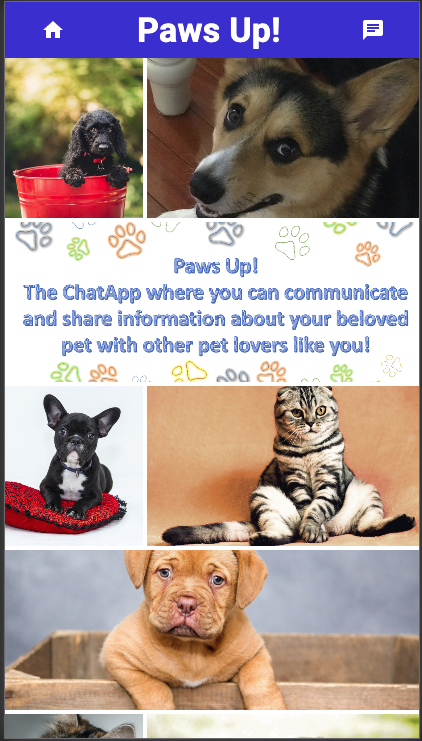

# PROJECT #3 MERN

       
    
## Description
Final Bootcamp project in which we needed to develop a complete App using the MERN stack. Secondary requirement was to use a CSS framework other than Bootstrap.

## Table of Content
- [usage](#usage)
- [licenses](#licenses)
- [contribution](#contribution)
- [test](#test)
- [deployment](#deployment)
   
### usage: 
  - The user will have access to the app via Heroku and will be able to run the app with the following steps:

  * After landing at the home page, the user should go to the Chat page by clicking the icon on the upper right of the header. 
  
  * User will be able to communicate with other users by adding his/her name and input a message.
 
### licenses: 
  - MIT
    
### contribution: 
  - Walter A. Joy IV
  - Scott St.Germain
  - Adsana Sayasith
  - Félix A. Colón
    
### test: 
  - To test this application you need to clone the repo.
  - Run npm start.
  - Lauch localhost:3000.

  * Paws Up! Homepage and Chat page.

   
       
    * Display of user adding name and message.

  

    * Display of user name and message in body of Chat page and with two messages on screen..

    

  [Heroku Deployment]()
    

